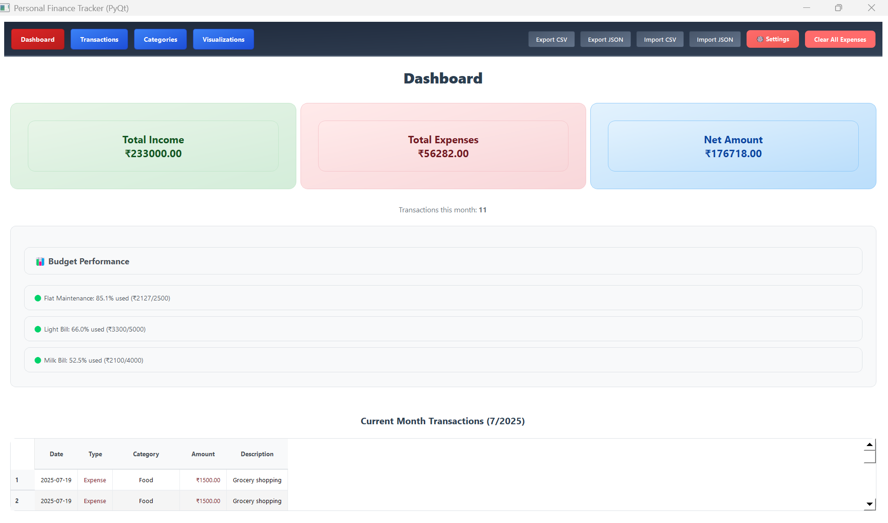
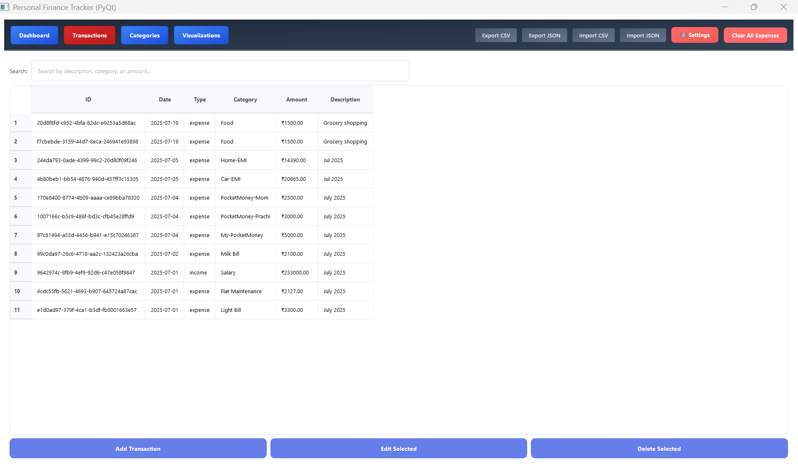
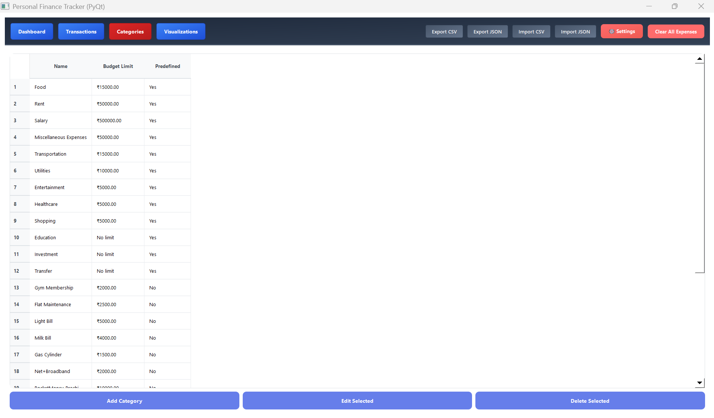
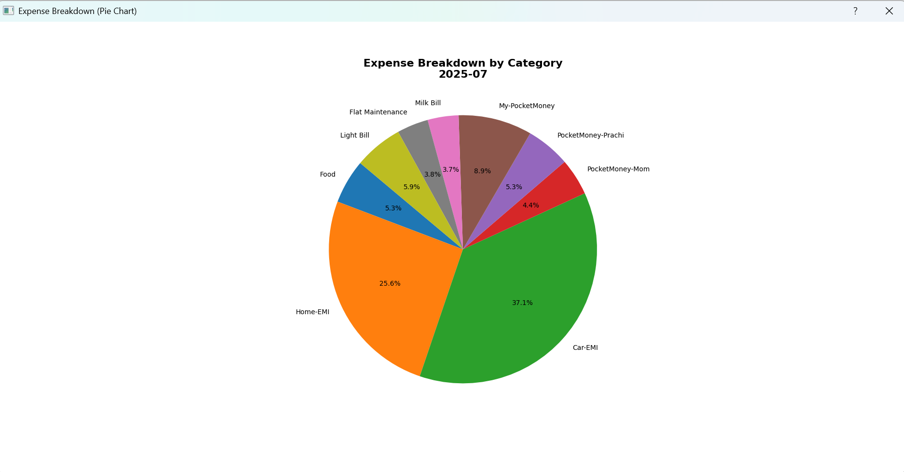
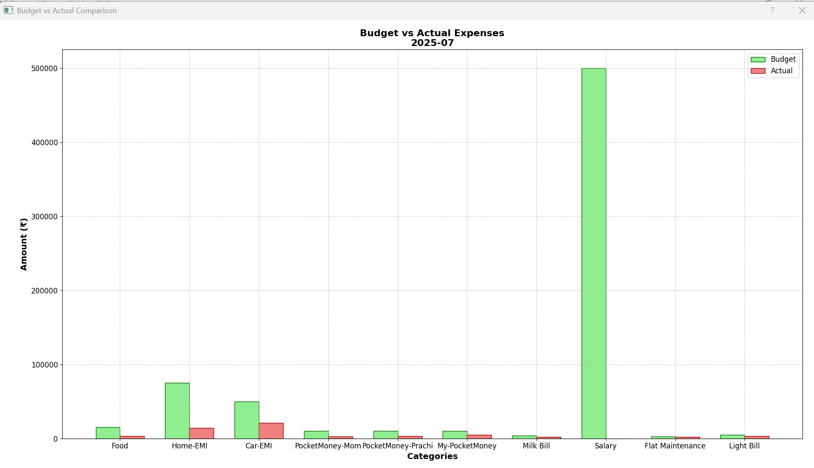
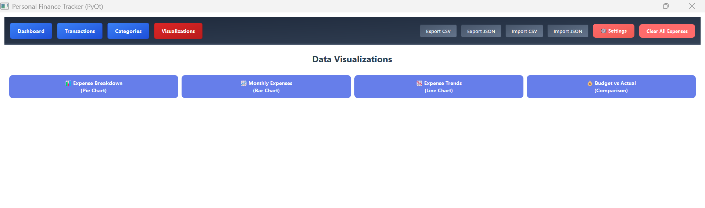

# Personal Finance Tracker (CLI + CSV + OOP)

A modern, feature-rich personal finance tracker with both CLI and PyQt GUI interfaces. Track income and expenses, manage categories, visualize spending, generate insights, and export/import data—all with CSV storage and robust OOP design.

## 🚀 App Showcase

### Dashboard

*The main dashboard provides a quick overview of your finances, including income, expenses, and net balance.*

### Transactions

*View and manage all your transactions in a clear, tabular format.*

### Categories

*Organize your spending and income into customizable categories.*

### Expense Breakdown (Pie Chart)

*Visualize your expenses by category with an interactive pie chart.*

### Actual vs Budget Chart

*Compare your actual spending against your budget for each category.*

### Visualization Option

*Choose from multiple visualization options to analyze your financial data.*

## ✨ **Latest Features (v2.1)**

### 🔐 **Data Encryption & Security**
- **AES-256 Encryption**: Military-grade encryption for sensitive financial data
- **Automatic Encryption**: All transaction data is automatically encrypted at rest
- **Secure Key Management**: Encryption keys are securely stored and managed
- **Migration Support**: Easy migration from unencrypted to encrypted format
- **Backup & Recovery**: Secure backup and restore functionality for encryption keys

### 🎨 **Enhanced UI/UX**
- **Modern Design**: Professional gradients, shadows, and hover effects
- **Improved Typography**: Segoe UI font family with better readability
- **Smart Navigation**: Active page highlighting and visual feedback
- **Responsive Layout**: Optimized for different screen sizes
- **Enhanced Cards**: Interactive summary cards with hover animations
- **Modern Forms**: Better input styling with focus states

### 🔍 **Advanced Functionality**
- **Smart Search**: Real-time transaction search by description, category, or amount
- **Financial Insights**: AI-powered recommendations and spending analysis
- **Budget Performance**: Track spending vs budgets with utilization metrics
- **Expense Trends**: Analyze spending patterns over multiple months
- **Category Analytics**: Detailed performance metrics for each category

### 📊 **Enhanced Visualizations**
- **Multiple Chart Types**: Pie, Bar, Line, and Comparison charts
- **Trend Analysis**: Line charts showing spending trends over time
- **Budget vs Actual**: Side-by-side comparison charts
- **Interactive Charts**: Hover effects and detailed tooltips
- **Export Charts**: Save visualizations as images

### 📁 **Data Management**
- **Export Features**: Export data in CSV and JSON formats
- **Import Features**: Import data from CSV and JSON files
- **Data Validation**: Comprehensive validation during import/export
- **Backup/Restore**: Easy data backup and restoration
- **File Dialogs**: User-friendly file selection

### ⚙️ **Settings & Preferences**
- **Settings Dialog**: Currency, date format, and theme options
- **Auto-save**: Automatic data saving preferences
- **Customization**: Personalize the application experience
- **Reset Options**: Easy reset to default settings

### 🚀 **Performance Optimizations**
- **Data Caching**: Smart caching for faster dashboard loading
- **Pagination**: Handle large datasets efficiently
- **Lazy Loading**: Load data on demand
- **Optimized Tables**: Efficient rendering for large transaction lists
- **Memory Management**: Better resource utilization

## Core Features
- ✅ **Add, edit, delete, and view transactions** with comprehensive validation
- ✅ **Manage categories and set budget limits** with data integrity checks
- ✅ **Summaries and reports** (monthly, yearly, by category)
- ✅ **Budget and overspending alerts** with real-time monitoring
- ✅ **Visualizations** (pie/bar charts) for expenses
- ✅ **Menu-driven CLI and modern PyQt GUI** with input validation
- ✅ **CSV-based storage** for portability
- ✅ **Unit-tested core logic** with comprehensive validation tests
- ✅ **Robust validation system** preventing data corruption

## 🔒 **Comprehensive Input Validation**
- **Category Validation**: Non-empty names, no duplicates, non-negative budget limits
- **Transaction Validation**: Positive amounts only, valid transaction types, required categories
- **Data Integrity**: Prevents invalid data from being stored in the system
- **Input Normalization**: Automatic whitespace trimming and data cleaning
- **User-Friendly Error Messages**: Clear feedback when validation fails

## Directory Structure
```
Personal Finance Tracker (CLI + CSV + OOP)/
├── data/                  # CSV files for transactions and categories
├── src/                   # Source code
│   ├── models/            # OOP models (Transaction, Category, BudgetManager)
│   ├── utils/             # CSV handler and helpers
│   ├── cli.py             # CLI entry point with validation
│   ├── gui.py             # Tkinter GUI with validation
│   └── qt_gui.py          # Enhanced PyQt GUI with all new features
├── tests/                 # Unit tests including validation tests
├── requirements.txt       # Python dependencies
└── README.md              # Project documentation
```

## Setup Instructions
1. **Clone the repository**
2. **Create and activate a virtual environment:**
   ```sh
   python -m venv .venv
   # On Windows:
   .venv\Scripts\activate
   # On macOS/Linux:
   source .venv/bin/activate
   ```
3. **Install dependencies:**
   ```sh
   pip install -r requirements.txt
   ```

## Running the App

### 🖥️ **PyQt GUI (Recommended)**
From the project root:
```sh
python src/qt_gui.py
```

### 💻 **CLI Version**
From the project root:
```sh
python -m src.cli
```

### 🪟 **Tkinter GUI Version**
From the project root:
```sh
python src/gui.py
```

## 🧪 **Running Tests**
From the project root (with the virtual environment activated):
```sh
# Run all tests
pytest

# Run validation tests specifically
pytest tests/test_validation.py

# Run basic functionality test
python tests/test_models.py
```

## 📊 **Dashboard Features**

### **Financial Insights Panel**
- Smart recommendations based on spending patterns
- Budget alerts for over-spending categories
- Monthly spending analysis
- Income vs expense tracking

### **Summary Cards**
- Total Income with green theming
- Total Expenses with red theming  
- Net Amount with blue theming
- Interactive hover effects

### **Transaction Management**
- Real-time search functionality
- Pagination for large datasets
- Color-coded transaction types
- Sortable columns

## 📈 **Visualization Features**

### **Chart Types Available**
1. **Pie Chart**: Expense breakdown by category
2. **Bar Chart**: Monthly expenses by category
3. **Line Chart**: Expense trends over time
4. **Comparison Chart**: Budget vs actual spending

### **Interactive Features**
- Hover effects on charts
- Detailed tooltips
- Export chart images
- Responsive chart sizing

## 🔧 **Settings & Configuration**

### **Available Settings**
- **Currency**: ₹ (INR), $ (USD), € (EUR), £ (GBP)
- **Date Format**: YYYY-MM-DD, DD/MM/YYYY, MM/DD/YYYY
- **Theme**: Light, Dark, Auto
- **Auto-save**: Enable/disable automatic saving

## 🔐 **Data Security & Encryption**

### **Encryption Features**
- **AES-256 Encryption**: Military-grade encryption using Fernet (AES-128 in CBC mode with PKCS7 padding)
- **Automatic Encryption**: All transaction data is automatically encrypted when saved
- **Secure Key Storage**: Encryption keys are stored securely in `data/.encryption_key`
- **Transparent Operation**: Encryption/decryption happens automatically in the background
- **Migration Support**: Easy migration from unencrypted to encrypted format

### **Key Management**
- **Automatic Key Generation**: New encryption keys are generated automatically on first use
- **Key Backup**: Secure backup functionality for encryption keys
- **Key Restoration**: Easy restoration from backup if needed
- **Key Isolation**: Each installation has its own unique encryption key

### **Migration Process**
To migrate existing unencrypted data to encrypted format:
```sh
python src/utils/migrate_to_encryption.py
```

This will:
- Create backups of your original data
- Encrypt all transaction files
- Remove unencrypted files (after backup)
- Generate a new encryption key if needed

## 📁 **Data Management**

### **Export Options**
- **CSV Export**: Standard spreadsheet format
- **JSON Export**: Structured data format
- **Timestamped Files**: Automatic file naming
- **Error Handling**: Comprehensive error reporting

### **Import Options**
- **CSV Import**: Import from spreadsheet files
- **JSON Import**: Import from structured data files
- **Data Validation**: Automatic validation during import
- **Error Reporting**: Detailed import error messages

## 🚀 **Performance Features**

### **Optimizations**
- **Smart Caching**: 5-minute cache for dashboard data
- **Pagination**: 50 transactions per page
- **Lazy Loading**: Load data on demand
- **Efficient Filtering**: Real-time search optimization
- **Memory Management**: Optimized resource usage

## Requirements
- Python 3.8+
- PyQt5 for GUI
- matplotlib for visualizations
- pandas for data handling
- cryptography for data encryption
- See `requirements.txt` for complete list

## Testing
The project includes comprehensive testing:
- **Unit Tests**: Test individual components and methods
- **Validation Tests**: Test all validation scenarios
- **Integration Tests**: Test complete workflows
- **Performance Tests**: Test with large datasets
- **UI Tests**: Test user interface functionality

## Architecture
The application follows a modular, object-oriented design:
- **Models**: Core business logic (Transaction, Category, BudgetManager)
- **Utils**: Helper functions (CSV handling, reporting, visualization)
- **UI**: Interface layers (CLI, Tkinter GUI, PyQt GUI)
- **Validation**: Comprehensive input validation at all layers
- **Performance**: Caching and optimization layers

## 🎯 **Use Cases**

### **Personal Finance Management**
- Track daily expenses and income
- Set and monitor budget limits
- Analyze spending patterns
- Generate financial reports

### **Business Expense Tracking**
- Categorize business expenses
- Monitor budget utilization
- Export data for accounting
- Generate expense reports

### **Financial Planning**
- Analyze spending trends
- Set financial goals
- Monitor budget performance
- Generate insights for better planning

## Future Enhancements
- Web interface (Flask/FastAPI)
- Database migration (SQLite/PostgreSQL)
- Multi-user support
- Advanced analytics and forecasting
- Mobile app integration
- API endpoints for external integrations
- Cloud synchronization
- Multi-currency support
- Investment tracking
- Bill reminders and notifications

## License
MIT License 